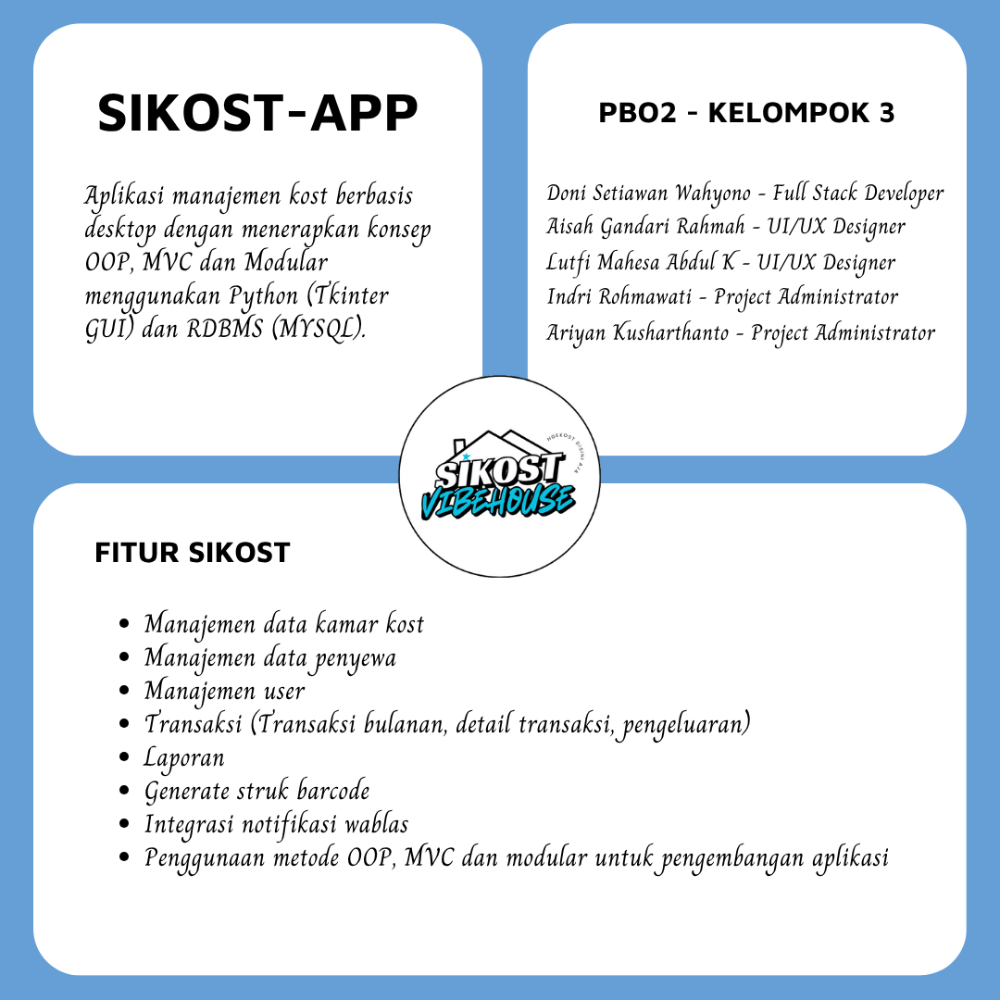

## Project Sistem Informasi Kost (SIKOST) Berbasis Desktop

Sistem Informasi Kost (SIKOST) adalah aplikasi berbasis desktop menggunakan bahasa pemrograman Python (TKinter GUI) dan MySQL yang digunakan untuk mengelola data kost secara efektif dan efisien. Aplikasi ini dirancang untuk membantu pengelola kost dalam melakukan pencatatan data kamar, penyewa, transaksi, dan laporan dengan mudah.

Fitur utama sementara meliputi:
- Manajemen data kamar kost
- Manajemen data penyewa
- Manajemen user
- Transaksi (Transaksi bulanan, detail transaksi, pengeluaran)
- Laporan
- Generate struk barcode
- Integrasi notifikasi wablas
- Penggunaan metode OOP, MVC dan modular untuk pengembangan aplikasi

---

## Teknologi yang Digunakan
- Bahasa Pemrograman: Python (Tkinter untuk GUI)
- Database: MySQL
- Koneksi Database: mysql-connector
- Metode Pengembangan: Agile

---

## Kelompok 3 - Mata Kuliah Pemrograman Berorientasi Objek 2 (PBO-2)

Anggota kelompok:

| Nama                                | Jobdesk                             |
|-------------------------------------|-------------------------------------|
| Doni Setiawan Wahyono - 23552011146 | Full Stack Developer                |
| Aisah Gandari Rahmah - 23552011127  | UI/UX Designer & Database Architect |
| Lutfi Mahesa Abdul K - 23552011147  | UI/UX Designer & Database Architect |
| Ariyan Kusharthanto - 23552011168   | Project Administrator & Research Analyst |
| Indri Rohmawati  -  23552011137     | Project Administrator & Research Analyst                                    |

## Implementasi Hasil Project

  
  

