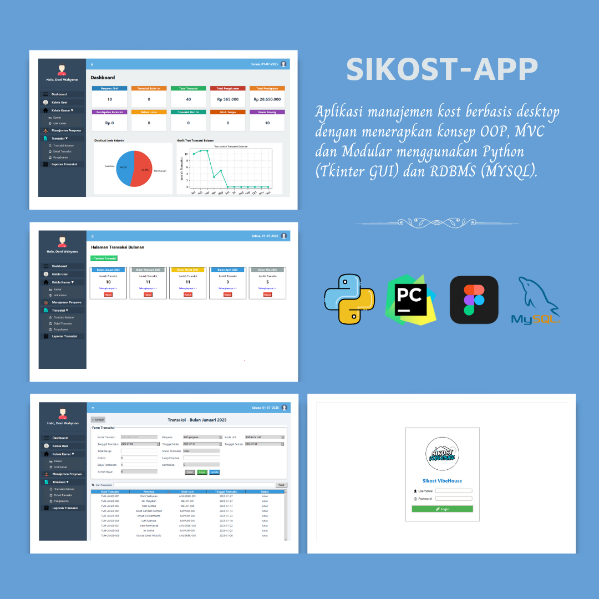
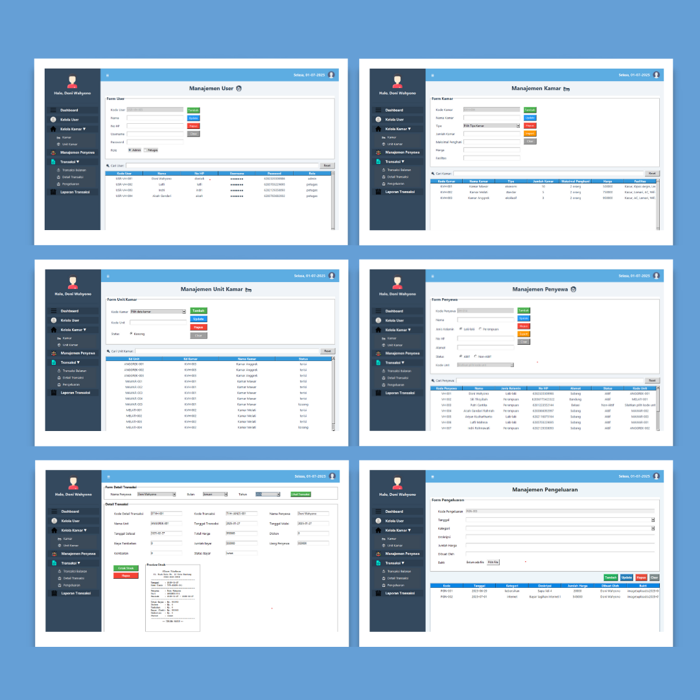
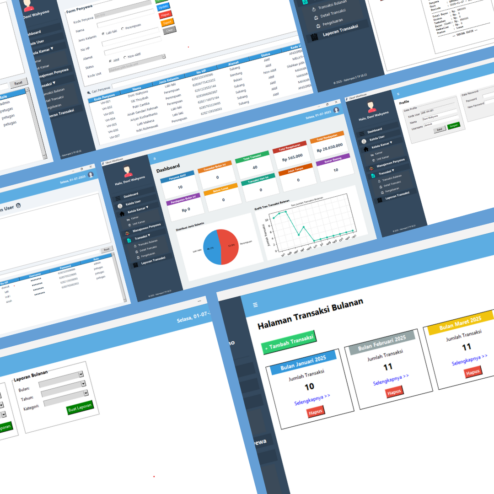

# 💡 Sistem Informasi Kost (SIKOST) VibeHouse - Aplikasi Desktop

**SIKOST VibeHouse** adalah aplikasi berbasis desktop yang dikembangkan menggunakan Python (Tkinter) dan MySQL untuk membantu pengelola kost dalam mencatat dan mengelola data penyewa, transaksi, kamar, hingga laporan keuangan dengan lebih efisien.

---

## ✨ Fitur Utama

- Manajemen data kamar kost
- Manajemen data penyewa
- Manajemen user
- Transaksi bulanan & detail transaksi
- Pengeluaran harian/bulanan
- Laporan keuangan (pemasukan & pengeluaran)
- Generate struk barcode
- Integrasi notifikasi WhatsApp via Wablas
- Arsitektur OOP, MVC, dan modular

---

## ⚙️ Teknologi yang Digunakan

- **Bahasa Pemrograman:** Python
- **GUI:** Tkinter
- **Database:** MySQL
- **Connector:** mysql-connector-python
- **Pengembangan:** Agile Methodology

---

## 👥 Kelompok 3 - PBO 2

| Nama                                | Jobdesk                             |
|-------------------------------------|-------------------------------------|
| Doni Setiawan Wahyono - 23552011146 | Full Stack Developer                |
| Aisah Gandari Rahmah - 23552011127  | UI/UX Designer & Database Architect |
| Lutfi Mahesa Abdul K - 23552011147  | UI/UX Designer & Database Architect |
| Ariyan Kusharthanto - 23552011168   | Project Administrator & Research Analyst |
| Indri Rohmawati - 23552011137       | Project Administrator & Research Analyst |

---

## 🖼️ Implementasi Tampilan Aplikasi

 |  | 

---

## 📦 Instalasi Aplikasi (Versi .exe)

Aplikasi **SIKOST VibeHouse** juga tersedia dalam bentuk **installer `.exe`**, agar pengguna Windows bisa langsung menggunakan tanpa perlu menginstal Python secara manual.

### 🔧 Langkah Instalasi:

1. Jalankan file: `SIKOST-VibeHouse-Installer.exe`
2. Ikuti wizard instalasi yang muncul.
3. Setelah instalasi selesai, shortcut aplikasi akan otomatis tersedia di:
   - **Start Menu**
   - **Desktop** (jika opsi shortcut dicentang)

### 📂 Lokasi Instalasi Default:
C:\Program Files\SIKOST VibeHouse\

## 📄 Lisensi

Aplikasi ini dikembangkan untuk keperluan pembelajaran dan project mata kuliah **PBO-2**. File lisensi dapat dilihat pada `setup/license.txt`.

---

Terima kasih telah menggunakan **SIKOST VibeHouse**! 🎉  
Feel free to fork, star, dan explore ✨